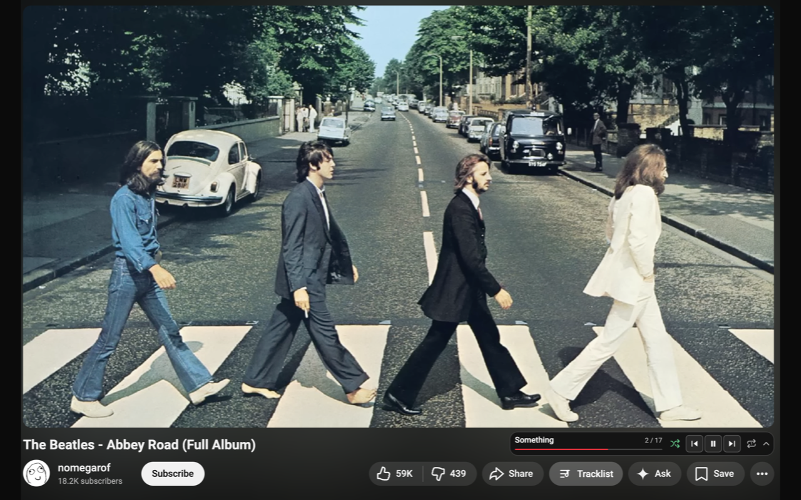

# Timestamp Player for YouTube

YouTube has lots of videos with timestamps, but it doesn't have playback controls that make full use of them. This extension fixes that.

Timestamp Player makes it easy to navigate tracks, seek within the current track, and even repeat and shuffle through tracks in any video that has timestamps.

It checks for timestamps in both the video description and top comments, and intelligently chooses the best set that it can find.

You can open and close the player by clicking the new "Tracklist" button located next to the Share button.

You can also use the player's corner controls to switch to compact view or pop out the player into a floating resizable panel.

[Install from the Chrome Web Store](https://chromewebstore.google.com/detail/apdohlkmddbfpmhkoeibajlhpnhilocb)

## Running Locally

1. Clone this repository.
2. Open your browser's extensions URL, e.g. `brave://extensions`.
3. Enable Developer mode.
4. Click Load unpacked.
5. Select this repository folder.
6. Ensure the extension is enabled. Click Reload on the
extension card after making any code changes.
7. Refresh the YouTube tab being tested.

## Test Videos

See `TEST_VIDEOS.md` for manual test cases.
